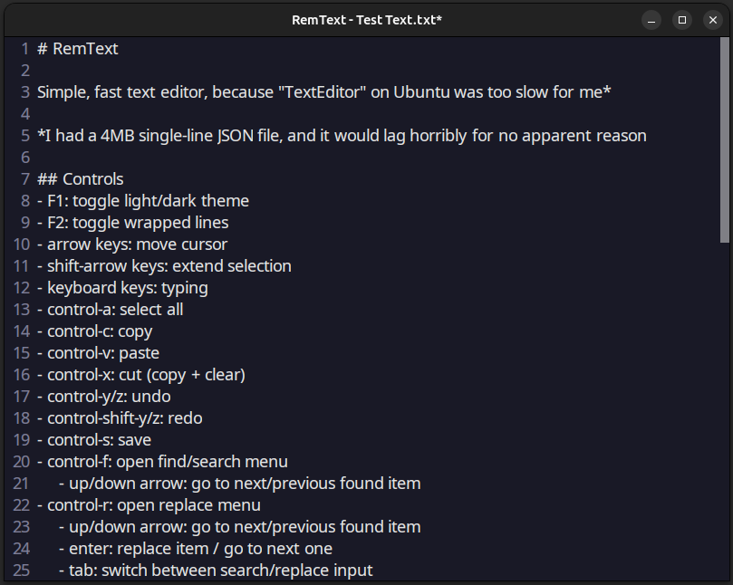

# RemText

Simple, fast text editor, because "TextEditor" on Ubuntu was too slow for me*

*I had a 4MB single-line JSON file, and it would lag horribly for no apparent reason

## Controls
- F1: toggle light/dark theme
- F2: toggle wrapped lines
- arrow keys: move cursor
- shift-arrow keys: extend selection
- keyboard keys: typing
- control-a: select all
- control-c: copy
- control-v: paste
- control-x: cut (copy + clear)
- control-y/z: undo
- control-shift-y/z: redo
- control-s: save
- control-f: open find/search menu
    - up/down arrow: go to next/previous found item
- control-r: open replace menu
    - up/down arrow: go to next/previous found item
    - enter: replace item / go to next one
    - tab: switch between search/replace input
- mouse-drag: select text
- mouse-click: set cursor
- mouse-wheel: scroll
- page-up/down: change font size
- escape: exit search/replace; exit program

## Planned Features
- JSON formatting
- JSON/YAML highlighting
- Markdown highlighting
- Basic C/Java code highlighting (numbers, keywords, brackets, comments maybe)
- Save-as-menu?
- New-file-menu?
- HexEdit-Mode?
- Rendering unknown symbols as hex-code

## Not-yet Planned
- Emojis
- Custom Fonts
- Custom Themes